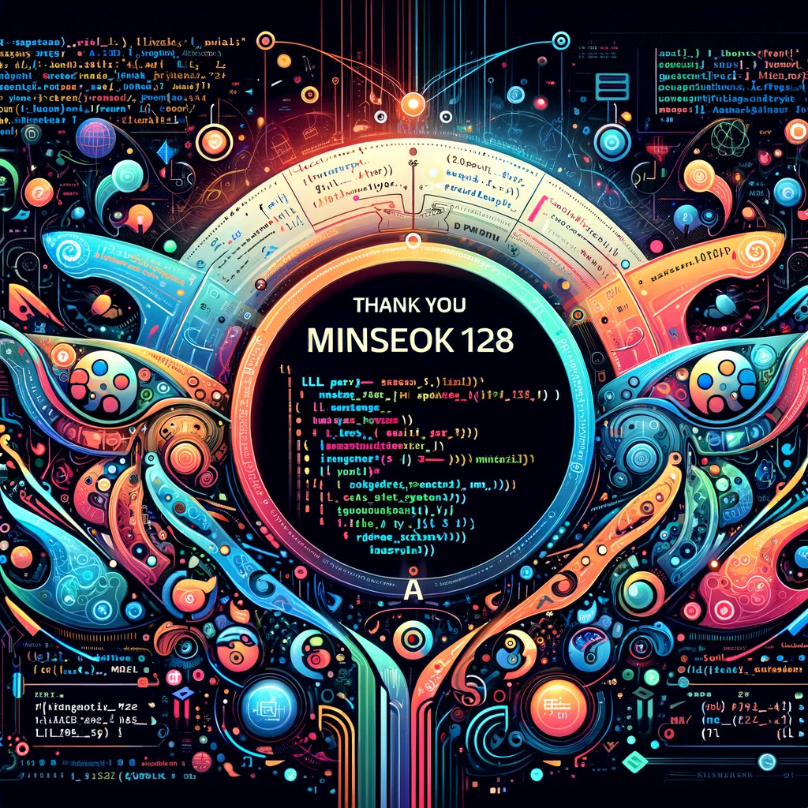

# Programming_laguage
2023_CAU_Programming_Language

Special Thanks to @Minseok128
I would like to extend my heartfelt gratitude to minseok128 for their invaluable contributions to the development of this LL Parser project. Your expertise, dedication, and insightful feedback have been instrumental in bringing this project to fruition.

Your collaborative spirit and technical skills have not only enhanced the project's quality but also enriched the learning and development my experience.

Thank you, minseok128, for being an integral part of this journey!

