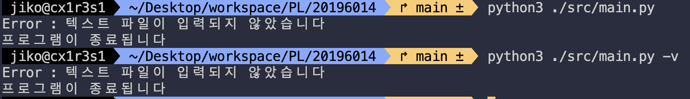
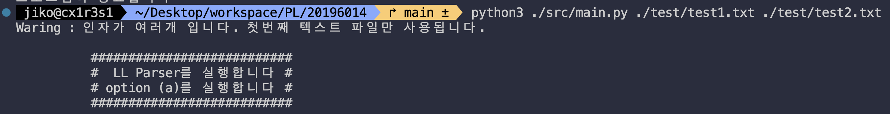
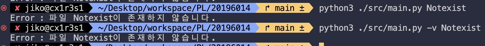
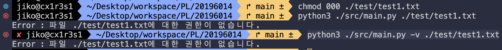
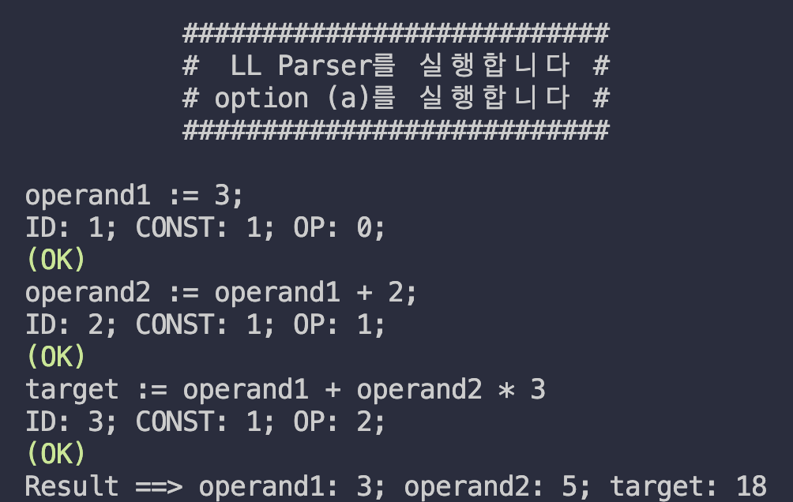

# Principles of Programming Languages Fall, 2023
## Programming Assignment #1

<hr>

### Problem
※ 파일을 통해 입력된 프로그램이 하나의 lookahead symbol 을 활용하는 아래의 LL(1) 
문법을 따르는지 여부를 판단하는 파서(Parser)를 Recursive Descent Parsing 기법을 
이용하여 작성하고, 파싱된 결과를 이용하여 입력된 프로그램의 결과를 출력하시오. 
<hr>

### Grammar

```
<program> → <statements>
<statements> → <statement> | <statement><semi_colon><statements>
<statement> → <ident><assignment_op><expression>
<expression> → <term><term_tail>
<term_tail> → <add_op><term><term_tail> | ε
<term> → <factor><factor_tail>
<factor_tail> → <mult_op><factor><factor_tail> | ε
<factor> → <left_paren><expression><right_paren> | <ident> | <const>
<const> → any decimal numbers
<ident> → any names conforming to C identifier rules
<assignment_op> → :=
<semi_colon> → ;
<add_operator> → + | -
<mult_operator> → * | /
<left_paren> → (
<right_paren> → )
```
<hr>

### How to use
* Option A
```
python3 ./src/main.py
or
python ./src/main.py
```
※ 출력-(a): 주어진 문법에 따라 입력파일에 저장되어 있는 프로그램을 분석한다. 
파싱(parsing)되는 과정을 <처리 예>와 같이 출력하고, 문법 오류 없이 파싱된 경우, 파싱 
트리를 구축하고, 이 트리를 이용하여 &lt;ident&gt;들의 최종값을 출력한다. 
=> 출력 형식: 
“프로그램에서 읽은 라인” 
“ID: {개수}; CONST: {개수}; OP: {개수};” 
“파싱 결과 (OK), (WARNING), (ERROR)” 
“Result ==> {변수 1}: {최종값}; {변수 2}: {최종값}; {변수 3}: {결과값};”  
* Option B
```
python3 ./src/main.py -v [textfile name]
or
python ./src/main.py -v [textfile name]
```
※ 출력-(b): 옵션으로 “-v”가 주어진 경우, 주어진 문법에 따라 입력파일에 저장되어 있는 
프로그램을 분석하되 출력-(a)의 파싱되는 과정은 출력하지 않는다. 대신, 아래 처리 조건의 
next_token 변수가 변경될 때마다 그 값을 출력한다. 
=> 출력 형식: 
“token1” 
“token2”  
“token3”
“...”
<hr>


### Implementations
<br>

#### Argument Handling
<br>

**No Argument**
- Exits the program
```
python3 ./src/main.py
python3 ./src/main.py -v
```
{: width="400px" : style="border-radius: 5px"}


**Multi Argument**
- Executes only the first argument
```
python3 ./src/main.py ./test/test1.txt ./test/test2.txt
python3 ./src/main.py -v ./test/test1.txt ./test/test2.txt
```
{: width="500px" : style="border-radius: 5px"}

**Non-existent File**
- Exits the program
```
python3 ./src/main.py Notexist
python3 ./src/main.py -v Notexist
```
{: width="500px" : style="border-radius: 5px"}

**No Read Permission**
- Exits the program
```
chmod 000 ./test/test1.txt 
python3 ./src/main.py ./test/test1.txt
python3 ./src/main.py -v ./test/test1.txt
```
{: width="500px" : style="border-radius: 5px"}


**Input**

```
python3 ./src/main.py ./test/test1.txt
```
```
operand1 := 3 ;
operand2 := operand1 + 2 ;
target := operand1 + operand2 * 3
```
{: width="200px" : style="border-radius: 10px"}