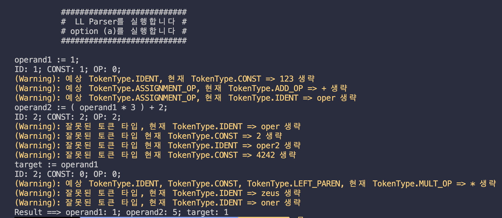

# Principles of Programming Languages Fall, 2023
## Programming Assignment #1
<p align="right"> 20196014 고지흔 </p>

<hr>

### Problem
※ 파일을 통해 입력된 프로그램이 하나의 lookahead symbol 을 활용하는 아래의 LL(1) 
문법을 따르는지 여부를 판단하는 파서(Parser)를 Recursive Descent Parsing 기법을 
이용하여 작성하고, 파싱된 결과를 이용하여 입력된 프로그램의 결과를 출력하시오. 
<hr>

### Grammar

```
<program> → <statements>
<statements> → <statement> | <statement><semi_colon><statements>
<statement> → <ident><assignment_op><expression>
<expression> → <term><term_tail>
<term_tail> → <add_op><term><term_tail> | ε
<term> → <factor><factor_tail>
<factor_tail> → <mult_op><factor><factor_tail> | ε
<factor> → <left_paren><expression><right_paren> | <ident> | <const>
<const> → any decimal numbers
<ident> → any names conforming to C identifier rules
<assignment_op> → :=
<semi_colon> → ;
<add_operator> → + | -
<mult_operator> → * | /
<left_paren> → (
<right_paren> → )
```
<hr>

### Development Environment
```
Mac
python3 --version
Python 3.8.2
```
```
Window
python --version
Python 3.10.5
```

### How to use
**Option A**
```
python3 ./src/main.py [textfile name]
or
python ./src/main.py [textfile name]
```
※ 출력-(a): 주어진 문법에 따라 입력파일에 저장되어 있는 프로그램을 분석한다. 
파싱(parsing)되는 과정을 <처리 예>와 같이 출력하고, 문법 오류 없이 파싱된 경우, 파싱 
트리를 구축하고, 이 트리를 이용하여 &lt;ident&gt;들의 최종값을 출력한다. 
=> 출력 형식: 
“프로그램에서 읽은 라인” 
“ID: {개수}; CONST: {개수}; OP: {개수};” 
“파싱 결과 (OK), (WARNING), (ERROR)” 
“Result ==> {변수 1}: {최종값}; {변수 2}: {최종값}; {변수 3}: {결과값};”  
**Option B**
```
python3 ./src/main.py -v [textfile name]
or
python ./src/main.py -v [textfile name]
```
※ 출력-(b): 옵션으로 “-v”가 주어진 경우, 주어진 문법에 따라 입력파일에 저장되어 있는 
프로그램을 분석하되 출력-(a)의 파싱되는 과정은 출력하지 않는다. 대신, 아래 처리 조건의 
next_token 변수가 변경될 때마다 그 값을 출력한다. 
=> 출력 형식: 
“token1” 
“token2”  
“token3”
“...”
<hr>


### Implementations
<br>

#### Program Execution Message
```
python3 ./src/main.py
python3 ./src/main.py -v
```
<p float="left">
  
  
</p>


#### Argument Handling

**No Argument**
- Exits the program
```
python3 ./src/main.py ./test/test1.txt
python3 ./src/main.py -v ./test/test1.txt
```


**Multi Argument**
- Executes only the first argument
```
python3 ./src/main.py ./test/test1.txt ./test/test2.txt
python3 ./src/main.py -v ./test/test1.txt ./test/test2.txt
```


**Non-existent File**
- Exits the program
```
python3 ./src/main.py Notexist
python3 ./src/main.py -v Notexist
```


**No Read Permission**
- Exits the program
```
chmod 000 ./test/test1.txt 
python3 ./src/main.py ./test/test1.txt
python3 ./src/main.py -v ./test/test1.txt
```


#### Input Example & Exception Handling

**입력 #1 파싱 결과 (OK) 시**
- “프로그램에서 읽은 라인” 
- “ID: {개수}; CONST: {개수}; OP: {개수};” 
- “파싱 결과 (OK)” 
- “Result ==> {변수 1}: {최종값}; {변수 2}: {최종값}; {변수 3}: {결과값}”
*Result 맨 끝 SEMI_COLON은 예시에 있는 것도 있고 없는 것도 있어서 ;넣지 않음*
```
python3 ./src/main.py ./test/test1.txt
```
```
operand1 := 3 ;
operand2 := operand1 + 2 ;
target := operand1 + operand2 * 3
```


**입력 #2 정의되지 않은 변수가 있을 시**
* 정의되지 않은 변수가 있다고 Error message 출력
* 정의되지 않은 변수는 unknown으로 처리
* Error이후 변수는 unknwon으로 정의되었다고 가정 후 에러를 띄우지 않음
*PDF의 출력과 값 맞춤*

```
python3 ./src/main.py ./test/test2.txt
```
```
operand2 := operand1 + 2 ; 
target := operand1 + operand2 * 3
```


**입력 #3**
```
python3 ./src/main.py ./test/test3.txt
```
```
operand1 := 1;
operand2 := (operand1 * 3) + 2 ; target := operand1 + operand2 * 3
```


**입력 #4 예외처리_1**
* 연산자 중복시 Warning message 출력 후 무시
```
python3 ./src/main.py ./test/test4.txt
```
```
operand1 := 3 ;
operand2 := operand1 + + 2 ; target := operand1 + operand2 * 3
```


**입력 #5 예외처리_2**
* 사용하지 않은 특수문자가 있을 시 warning message 출력 후 무시
```
python3 ./src/main.py ./test/test5.txt
```
```
ope#`rand1 := 3 ;
operand2 := opera^@^nd1 + 2 ;
target := operand1&$
```


**입력 #6 예외처리_3**
* 연산이 완료되지 않았을 경우 Error message 출력 후 unknown으로 할당
```
python3 ./src/main.py ./test/test6.txt
```
```
operand1 := ;
operand2 := operand1 + - ;
target := operand1 + operand2 *
```


**입력 #7 예외처리_4**
* ':=' 대신 ':'만 입력시 할당 연산자 오타로 간주 => 오타 수정
* ':=' 대신 '=:' 입력시 할당 연산자 오타로 간주 => 오타 수정
* '=' 입력시 할당 연산자 오타가 아닌 특수문자로 생각 => 할당 연산자 나올 때까지 토큰 생략
```
python3 ./src/main.py ./test/test7.txt
```
```
operand1 : 3 ;
operand2 =: operand1 + 2 ;
target = operand2 * 3
```


**입력 #8 예외처리_5**
* Left Parenthesis가 더 많을 경우 Warning message 출력 후 맨 마지막에 Right Parenthesis 추가
* Right Parenthesis가 더 많을 경우 Warning message 출력 후 무시
```
python3 ./src/main.py ./test/test8.txt
```

```
operand1 := (3) ;
operand2 := ((operand1 + 2 ;
target := (operand1)) + operand2)) * 3)
```


**입력 #9 예외처리_6**
* 같은 연산자 토큰이 연속으로 나올 경우 중복된 연산자라는 Warning message 출력 후 무시
* 다른 연산자 토큰이 연속으로 나올 경우 존재해서 안되는 토큰이라는 Warning message 출력 후 무시
```
python3 ./src/main.py ./test/test9.txt
```

```
operand1 := := 1;
operand2 := (operand1 **/ 3) + 2 ;
target := operand1 +-+- operand2 *+ 3
```


**입력 #10 예외처리_7**
* 문법에 맞지 않는 토큰이 있을 경우 예상 토큰을 Warning message 출력 후 무시
```
python3 ./src/main.py ./test/test10.txt
```
```
123 operand1 + oper := 1;
operand2 := (operand1 oper * 3 2 oper2 ) + 2 4242 ;
target := * operand1 zeus oner
```



**입력 #11 예외처리_8**
* ident가 없는 경우 Error message 출력
* 0으로 나누는 경우 Error message 출력 후 unknown으로 할당
```
python3 ./src/main.py ./test/test11.txt
```
```
:= 1;
operand2 := (4242 / 0) + 2 ;
target := operand2 * 3
```


**입력 #12 Random**
```
python3 ./src/main.py ./test/random.txt
```
```
sdfhsihlogvd890t8rt54w%%$^*#(&*)(_)_+&(&^&W$%$%@^%^_%%)$_%)#$_^(W_H_FGJOSDgfjadbhljLSjlkvF:F"H:"<{><P>P}MN{GF{NCBDGdG:::SDF:SG:DKBSGSG:;
''ds'gvlkdfojtwer,.snf23[5095956-5ye/*2/*542/4*bs0vu09xu=fe0w9r3453995809</P>{}})rogjpet2wr3wrw:=efwrogpjvpoej234154389t74t4t4jh5kk32jbndsivusdtuw9t
gjiwrogjipsvs;;;sdf;sdf;sd;fs;g;;we;;5324;;54;3t:=;;dsfd;g;df;gd;g;e;t4;52==23;=23;5467;9;0;;():():():(:)()(:)9;090;9;09;0;thjeijpsdfsd
```
*output*
```
          ###########################
          #  LL Parser를 실행합니다 #
          # option (a)를 실행합니다 #
          ###########################

sdfhsihlogvd890t8rt54w := FH; 
ID: 2; CONST: 0; OP: 0;
(Warning): Undefined token: '%'가 제거되었습니다.
(Warning): Undefined token: '%'가 제거되었습니다.
(Warning): Undefined token: '$'가 제거되었습니다.
(Warning): Undefined token: '^'가 제거되었습니다.
(Warning): 예상 TokenType.ASSIGNMENT_OP, 현재 TokenType.MULT_OP => * 생략
(Warning): Undefined token: '#'가 제거되었습니다.
(Warning): 예상 TokenType.ASSIGNMENT_OP, 현재 TokenType.LEFT_PAREN => ( 생략
(Warning): Undefined token: '&'가 제거되었습니다.
(Warning): 예상 TokenType.ASSIGNMENT_OP, 현재 TokenType.MULT_OP => * 생략
(Warning): 예상 TokenType.ASSIGNMENT_OP, 현재 TokenType.RIGHT_PAREN => ) 생략
(Warning): 예상 TokenType.ASSIGNMENT_OP, 현재 TokenType.LEFT_PAREN => ( 생략
(Warning): 예상 TokenType.ASSIGNMENT_OP, 현재 TokenType.IDENT => _ 생략
(Warning): 예상 TokenType.ASSIGNMENT_OP, 현재 TokenType.RIGHT_PAREN => ) 생략
(Warning): 예상 TokenType.ASSIGNMENT_OP, 현재 TokenType.IDENT => _ 생략
(Warning): 예상 TokenType.ASSIGNMENT_OP, 현재 TokenType.ADD_OP => + 생략
(Warning): Undefined token: '&'가 제거되었습니다.
(Warning): 예상 TokenType.ASSIGNMENT_OP, 현재 TokenType.LEFT_PAREN => ( 생략
(Warning): Undefined token: '&'가 제거되었습니다.
(Warning): Undefined token: '^'가 제거되었습니다.
(Warning): Undefined token: '&'가 제거되었습니다.
(Warning): Undefined token: '$'가 제거되었습니다.
(Warning): Undefined token: '%'가 제거되었습니다.
(Warning): Undefined token: '$'가 제거되었습니다.
(Warning): Undefined token: '%'가 제거되었습니다.
(Warning): Undefined token: '@'가 제거되었습니다.
(Warning): Undefined token: '^'가 제거되었습니다.
(Warning): Undefined token: '%'가 제거되었습니다.
(Warning): Undefined token: '^'가 제거되었습니다.
(Warning): Undefined token: '%'가 제거되었습니다.
(Warning): Undefined token: '%'가 제거되었습니다.
(Warning): 예상 TokenType.ASSIGNMENT_OP, 현재 TokenType.IDENT => W_ 생략
(Warning): 예상 TokenType.ASSIGNMENT_OP, 현재 TokenType.RIGHT_PAREN => ) 생략
(Warning): Undefined token: '$'가 제거되었습니다.
(Warning): Undefined token: '%'가 제거되었습니다.
(Warning): 예상 TokenType.ASSIGNMENT_OP, 현재 TokenType.IDENT => _ 생략
(Warning): 예상 TokenType.ASSIGNMENT_OP, 현재 TokenType.RIGHT_PAREN => ) 생략
(Warning): Undefined token: '#'가 제거되었습니다.
(Warning): Undefined token: '$'가 제거되었습니다.
(Warning): Undefined token: '^'가 제거되었습니다.
(Warning): 예상 TokenType.ASSIGNMENT_OP, 현재 TokenType.IDENT => _ 생략
(Warning): 예상 TokenType.ASSIGNMENT_OP, 현재 TokenType.LEFT_PAREN => ( 생략
(Warning): 예상 TokenType.ASSIGNMENT_OP, 현재 TokenType.IDENT => W_H_FGJOSDgfjadbhljLSjlkvF 생략
(Warning): 오타 수정 : ':'가 ':='로 변경되었습니다.
(Warning): Undefined token: '"'가 제거되었습니다.
(Warning): Undefined token: '"'가 제거되었습니다.
(Warning): Undefined token: '<'가 제거되었습니다.
(Warning): Undefined token: '{'가 제거되었습니다.
(Warning): Undefined token: '>'가 제거되었습니다.
(Warning): Undefined token: '<'가 제거되었습니다.
(Warning): 오타 수정 : ':'가 ':='로 변경되었습니다.
(Warning): 잘못된 토큰 타입, 현재 TokenType.ASSIGNMENT_OP => := 생략
(Warning): Undefined token: '>'가 제거되었습니다.
(Warning): Undefined token: '}'가 제거되었습니다.
(Warning): Undefined token: '{'가 제거되었습니다.
(Warning): Undefined token: '{'가 제거되었습니다.
(Warning): 잘못된 토큰 타입, 현재 TokenType.IDENT => PPMNGFNCBDGdG 생략
(Warning): 오타 수정 : ':'가 ':='로 변경되었습니다.
(Warning): 잘못된 토큰 타입, 현재 TokenType.ASSIGNMENT_OP => := 생략
(Warning): 오타 수정 : ':'가 ':='로 변경되었습니다.
(Warning): 잘못된 토큰 타입, 현재 TokenType.ASSIGNMENT_OP => := 생략
(Warning): 오타 수정 : ':'가 ':='로 변경되었습니다.
(Warning): 잘못된 토큰 타입, 현재 TokenType.ASSIGNMENT_OP => := 생략
(Warning): 오타 수정 : ':'가 ':='로 변경되었습니다.
(Warning): 잘못된 토큰 타입, 현재 TokenType.ASSIGNMENT_OP => := 생략
(Warning): 잘못된 토큰 타입, 현재 TokenType.IDENT => SDF 생략
(Warning): 오타 수정 : ':'가 ':='로 변경되었습니다.
(Warning): 잘못된 토큰 타입, 현재 TokenType.ASSIGNMENT_OP => := 생략
(Warning): 잘못된 토큰 타입, 현재 TokenType.IDENT => SG 생략
(Warning): 오타 수정 : ':'가 ':='로 변경되었습니다.
(Warning): 잘못된 토큰 타입, 현재 TokenType.ASSIGNMENT_OP => := 생략
(Warning): 잘못된 토큰 타입, 현재 TokenType.IDENT => DKBSGSG 생략
(Warning): 오타 수정 : ':'가 ':='로 변경되었습니다.
(Warning): 잘못된 토큰 타입, 현재 TokenType.ASSIGNMENT_OP => := 생략
(Error): "정의되지 않은 변수(FH)가 참조됨"
dsgvlkdfojtwersnf235095956 := efwrogpjvpoej234154389t74t4t4jh5kk32jbndsivusdtuw9t; 
ID: 2; CONST: 0; OP: 0;
(Warning): Undefined token: '''가 제거되었습니다.
(Warning): Undefined token: '''가 제거되었습니다.
(Warning): Undefined token: '''가 제거되었습니다.
(Warning): Undefined token: ','가 제거되었습니다.
(Warning): Undefined token: '.'가 제거되었습니다.
(Warning): Undefined token: '['가 제거되었습니다.
(Warning): 예상 TokenType.ASSIGNMENT_OP, 현재 TokenType.ADD_OP => - 생략
(Warning): 예상 TokenType.ASSIGNMENT_OP, 현재 TokenType.CONST => 5 생략
(Warning): 예상 TokenType.ASSIGNMENT_OP, 현재 TokenType.IDENT => ye 생략
(Warning): 예상 TokenType.ASSIGNMENT_OP, 현재 TokenType.MULT_OP => / 생략
(Warning): 예상 TokenType.ASSIGNMENT_OP, 현재 TokenType.MULT_OP => * 생략
(Warning): 예상 TokenType.ASSIGNMENT_OP, 현재 TokenType.CONST => 2 생략
(Warning): 예상 TokenType.ASSIGNMENT_OP, 현재 TokenType.MULT_OP => / 생략
(Warning): 예상 TokenType.ASSIGNMENT_OP, 현재 TokenType.MULT_OP => * 생략
(Warning): 예상 TokenType.ASSIGNMENT_OP, 현재 TokenType.CONST => 542 생략
(Warning): 예상 TokenType.ASSIGNMENT_OP, 현재 TokenType.MULT_OP => / 생략
(Warning): 예상 TokenType.ASSIGNMENT_OP, 현재 TokenType.CONST => 4 생략
(Warning): 예상 TokenType.ASSIGNMENT_OP, 현재 TokenType.MULT_OP => * 생략
(Warning): 예상 TokenType.ASSIGNMENT_OP, 현재 TokenType.IDENT => bs0vu09xu 생략
(Warning): Undefined token: '='가 제거되었습니다.
(Warning): Undefined token: '<'가 제거되었습니다.
(Warning): 예상 TokenType.ASSIGNMENT_OP, 현재 TokenType.IDENT => fe0w9r3453995809 생략
(Warning): 예상 TokenType.ASSIGNMENT_OP, 현재 TokenType.MULT_OP => / 생략
(Warning): Undefined token: '>'가 제거되었습니다.
(Warning): Undefined token: '{'가 제거되었습니다.
(Warning): Undefined token: '}'가 제거되었습니다.
(Warning): Undefined token: '}'가 제거되었습니다.
(Warning): 예상 TokenType.ASSIGNMENT_OP, 현재 TokenType.IDENT => P 생략
(Warning): 예상 TokenType.ASSIGNMENT_OP, 현재 TokenType.RIGHT_PAREN => ) 생략
(Warning): 예상 TokenType.ASSIGNMENT_OP, 현재 TokenType.IDENT => rogjpet2wr3wrw 생략
(Warning): 잘못된 토큰 타입, 현재 TokenType.IDENT => gjiwrogjipsvs 생략
(Error): "정의되지 않은 변수(efwrogpjvpoej234154389t74t4t4jh5kk32jbndsivusdtuw9t)가 참조됨"
; 
ID: 0; CONST: 0; OP: 0;
(Error): Error : IDENT가 없어 문법에 맞지 않습니다
; 
ID: 0; CONST: 0; OP: 0;
(Error): Error : IDENT가 없어 문법에 맞지 않습니다
sdf; 
ID: 1; CONST: 0; OP: 0;
(Error): Error : ASSIGNMENT_OP가 없어 문법에 맞지 않습니다
sdf; 
ID: 1; CONST: 0; OP: 0;
(Error): Error : ASSIGNMENT_OP가 없어 문법에 맞지 않습니다
sd; 
ID: 1; CONST: 0; OP: 0;
(Error): Error : ASSIGNMENT_OP가 없어 문법에 맞지 않습니다
fs; 
ID: 1; CONST: 0; OP: 0;
(Error): Error : ASSIGNMENT_OP가 없어 문법에 맞지 않습니다
g; 
ID: 1; CONST: 0; OP: 0;
(Error): Error : ASSIGNMENT_OP가 없어 문법에 맞지 않습니다
; 
ID: 0; CONST: 0; OP: 0;
(Error): Error : IDENT가 없어 문법에 맞지 않습니다
we; 
ID: 1; CONST: 0; OP: 0;
(Error): Error : ASSIGNMENT_OP가 없어 문법에 맞지 않습니다
; 
ID: 0; CONST: 0; OP: 0;
(Error): Error : IDENT가 없어 문법에 맞지 않습니다
; 
ID: 0; CONST: 0; OP: 0;
(Warning): 예상 TokenType.IDENT, 현재 TokenType.CONST => 5324 생략
(Error): Error : IDENT가 없어 문법에 맞지 않습니다
; 
ID: 0; CONST: 0; OP: 0;
(Error): Error : IDENT가 없어 문법에 맞지 않습니다
; 
ID: 0; CONST: 0; OP: 0;
(Warning): 예상 TokenType.IDENT, 현재 TokenType.CONST => 54 생략
(Error): Error : IDENT가 없어 문법에 맞지 않습니다
t :=; 
ID: 1; CONST: 0; OP: 0;
(Warning): 예상 TokenType.IDENT, 현재 TokenType.CONST => 3 생략
(Error): Error : 연산이 완료되지 않았습니다
; 
ID: 0; CONST: 0; OP: 0;
(Error): Error : IDENT가 없어 문법에 맞지 않습니다
dsfd; 
ID: 1; CONST: 0; OP: 0;
(Error): Error : ASSIGNMENT_OP가 없어 문법에 맞지 않습니다
g; 
ID: 1; CONST: 0; OP: 0;
(Error): Error : ASSIGNMENT_OP가 없어 문법에 맞지 않습니다
df; 
ID: 1; CONST: 0; OP: 0;
(Error): Error : ASSIGNMENT_OP가 없어 문법에 맞지 않습니다
gd; 
ID: 1; CONST: 0; OP: 0;
(Error): Error : ASSIGNMENT_OP가 없어 문법에 맞지 않습니다
g; 
ID: 1; CONST: 0; OP: 0;
(Error): Error : ASSIGNMENT_OP가 없어 문법에 맞지 않습니다
e; 
ID: 1; CONST: 0; OP: 0;
(Error): Error : ASSIGNMENT_OP가 없어 문법에 맞지 않습니다
t4; 
ID: 1; CONST: 0; OP: 0;
(Error): Error : ASSIGNMENT_OP가 없어 문법에 맞지 않습니다
; 
ID: 0; CONST: 0; OP: 0;
(Warning): 예상 TokenType.IDENT, 현재 TokenType.CONST => 52 생략
(Warning): Undefined token: '='가 제거되었습니다.
(Warning): Undefined token: '='가 제거되었습니다.
(Warning): 예상 TokenType.IDENT, 현재 TokenType.CONST => 23 생략
(Error): Error : IDENT가 없어 문법에 맞지 않습니다
; 
ID: 0; CONST: 0; OP: 0;
(Warning): Undefined token: '='가 제거되었습니다.
(Warning): 예상 TokenType.IDENT, 현재 TokenType.CONST => 23 생략
(Error): Error : IDENT가 없어 문법에 맞지 않습니다
; 
ID: 0; CONST: 0; OP: 0;
(Warning): 예상 TokenType.IDENT, 현재 TokenType.CONST => 5467 생략
(Error): Error : IDENT가 없어 문법에 맞지 않습니다
; 
ID: 0; CONST: 0; OP: 0;
(Warning): 예상 TokenType.IDENT, 현재 TokenType.CONST => 9 생략
(Error): Error : IDENT가 없어 문법에 맞지 않습니다
; 
ID: 0; CONST: 0; OP: 0;
(Warning): 예상 TokenType.IDENT, 현재 TokenType.CONST => 0 생략
(Error): Error : IDENT가 없어 문법에 맞지 않습니다
; 
ID: 0; CONST: 0; OP: 0;
(Error): Error : IDENT가 없어 문법에 맞지 않습니다
; 
ID: 0; CONST: 0; OP: 0;
(Warning): 예상 TokenType.IDENT, 현재 TokenType.LEFT_PAREN => ( 생략
(Warning): 예상 TokenType.IDENT, 현재 TokenType.RIGHT_PAREN => ) 생략
(Warning): 오타 수정 : ':'가 ':='로 변경되었습니다.
(Warning): 예상 TokenType.IDENT, 현재 TokenType.ASSIGNMENT_OP => := 생략
(Warning): 예상 TokenType.IDENT, 현재 TokenType.LEFT_PAREN => ( 생략
(Warning): 예상 TokenType.IDENT, 현재 TokenType.RIGHT_PAREN => ) 생략
(Warning): 오타 수정 : ':'가 ':='로 변경되었습니다.
(Warning): 예상 TokenType.IDENT, 현재 TokenType.ASSIGNMENT_OP => := 생략
(Warning): 예상 TokenType.IDENT, 현재 TokenType.LEFT_PAREN => ( 생략
(Warning): 예상 TokenType.IDENT, 현재 TokenType.RIGHT_PAREN => ) 생략
(Warning): 오타 수정 : ':'가 ':='로 변경되었습니다.
(Warning): 예상 TokenType.IDENT, 현재 TokenType.ASSIGNMENT_OP => := 생략
(Warning): 예상 TokenType.IDENT, 현재 TokenType.LEFT_PAREN => ( 생략
(Warning): 오타 수정 : ':'가 ':='로 변경되었습니다.
(Warning): 예상 TokenType.IDENT, 현재 TokenType.ASSIGNMENT_OP => := 생략
(Warning): 예상 TokenType.IDENT, 현재 TokenType.RIGHT_PAREN => ) 생략
(Warning): 예상 TokenType.IDENT, 현재 TokenType.LEFT_PAREN => ( 생략
(Warning): 예상 TokenType.IDENT, 현재 TokenType.RIGHT_PAREN => ) 생략
(Warning): 예상 TokenType.IDENT, 현재 TokenType.LEFT_PAREN => ( 생략
(Warning): 오타 수정 : ':'가 ':='로 변경되었습니다.
(Warning): 예상 TokenType.IDENT, 현재 TokenType.ASSIGNMENT_OP => := 생략
(Warning): 예상 TokenType.IDENT, 현재 TokenType.RIGHT_PAREN => ) 생략
(Warning): 예상 TokenType.IDENT, 현재 TokenType.CONST => 9 생략
(Error): Error : IDENT가 없어 문법에 맞지 않습니다
; 
ID: 0; CONST: 0; OP: 0;
(Warning): 예상 TokenType.IDENT, 현재 TokenType.CONST => 090 생략
(Error): Error : IDENT가 없어 문법에 맞지 않습니다
; 
ID: 0; CONST: 0; OP: 0;
(Warning): 예상 TokenType.IDENT, 현재 TokenType.CONST => 9 생략
(Error): Error : IDENT가 없어 문법에 맞지 않습니다
; 
ID: 0; CONST: 0; OP: 0;
(Warning): 예상 TokenType.IDENT, 현재 TokenType.CONST => 09 생략
(Error): Error : IDENT가 없어 문법에 맞지 않습니다
; 
ID: 0; CONST: 0; OP: 0;
(Warning): 예상 TokenType.IDENT, 현재 TokenType.CONST => 0 생략
(Error): Error : IDENT가 없어 문법에 맞지 않습니다
thjeijpsdfsd 
ID: 1; CONST: 0; OP: 0;
(Error): Error : ASSIGNMENT_OP가 없어 문법에 맞지 않습니다
Result ==> FH: Unknown; df: Unknown; dsfd: Unknown; dsgvlkdfojtwersnf235095956: Unknown; e: Unknown; efwrogpjvpoej234154389t74t4t4jh5kk32jbndsivusdtuw9t: Unknown; fs: Unknown; g: Unknown; gd: Unknown; sd: Unknown; sdf: Unknown; sdfhsihlogvd890t8rt54w: Unknown; t: Unknown; t4: Unknown; thjeijpsdfsd: Unknown; we: Unknown
```

**입력 #13 -v Option**
* -v 옵션을 주면 파싱되는 과정을 출력하지 않음
* 문장이 바뀌면 빈 줄 하나를 출력
```
python3 ./src/main.py -v ./test/test1.txt
```
```
operand1 := 3 ;
operand2 := operand1 + 2 ;
target := operand1 + operand2 * 3
```

